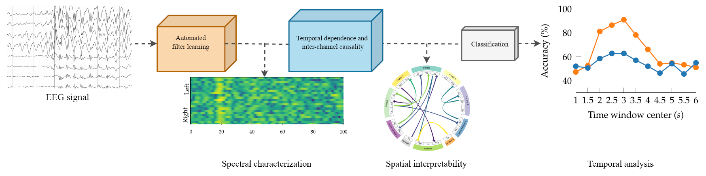

# TEKTE-Net: Takens-Based Kernel Transfer Entropy Connectivity Network

This repository contains the source code and experimental notebooks developed as part of the research work presented in the paper **“TEKTE-Net: A Takens-Based Kernel Transfer Entropy Connectivity Network for EEG-Based Motor Imagery Classification”**.

The project explores a novel deep learning framework for **EEG functional connectivity analysis**, combining **Takens embedding**, **kernelized Transfer Entropy**, and **convolutional neural architectures** (EEGNet and LeNet branches) to capture **directed, nonlinear, and frequency-specific dependencies** across brain regions during motor imagery tasks.



---

## Overview

TEKTE-Net introduces a hybrid architecture designed to:
- Reconstruct **time-frequency EEG dynamics** via Takens embeddings.  
- Estimate **directed functional connectivity** using a kernelized Transfer Entropy formulation.  
- Fuse **spatial-temporal information** through deep convolutional encoders (LeNet-style and EEGNet-style).  
- Enhance **inter-subject generalization** through latent-space regularization and multi-loss optimization.  

The model was evaluated on public BCI datasets such as **BCI Competition IV-2a** and **GigaScience MI-DBIII**, demonstrating consistent performance improvements over baseline methods.

---

## Repository Structure

```

TEKTENet/
│
├── notebooks/
│   ├── te-sintetic-cv-5-folds.ipynb   # Experiments using the Semi-Synthetic Causal EEG Benchmark dataset
│   ├── grafica-folds.ipynb            # Plots of robustness with respect to noise
│   ├── model-tunner.ipynb             # Includes the custom layers, the full model definition, and the hyperparameter search
│   ├── ventanas-te.ipynb              # Interpretability analysis on both training and test data for each subject
│   ├── te-random-conectivities.ipynb  # Visualization of the connectivity patterns for each trained model
│   ├── filtros-de-la-depthwise.ipynb  # Code to extract the filters from the Depthwise layer of each model
│   └── filtros.ipynb                  # Plots of the filters extracted for each fold.
│
├── results/
│   ├── fold_{i}.pkl               # Saved models per cross-validation fold
│   ├── indices_kus.dat            # Dataset split indices
│   └── reconstruction_values.dat  # Stored values for LaTeX reconstruction
│
├── requirements.txt               # Dependencies
└── README.md                      # Project description (this file)

````

---

## Installation

Clone the repository and install the dependencies:

```bash
git clone https://github.com/alegomezri/TEKTE-Net.git
cd TEKTENet
pip install -r requirements.txt
````

---

## Usage

Open and execute the main notebook:

```bash
jupyter notebook notebooks/TEKTE_Net_Main.ipynb
```

or run the connectivity analysis directly:

```python
!python utils/connectivity_analysis.py
```

---

## Citation

If you use this code in your research, please cite:

```
@article{gomez2025tektnet,
  title={TEKTE-Net: A Takens-Based Kernel Transfer Entropy Connectivity Network for EEG-Based Motor Imagery Classification},
  author={Gómez-Rivera, Yessica Alejandra and others},
  doi={doi.org/10.3390/s25227067}
  journal={Sensors},
  year={2025}
}
```

---

## License

This project is released under the **MIT License**.
Feel free to use and modify it for academic or research purposes.

---

## Contact

For questions or collaborations, please contact:
**Yessica Alejandra Gómez Rivera**
Universidad Nacional de Colombia sede Manizales 
✉️ [yeagomezri@unal.edu.co](mailto:yeagomezri@unal.edu.co)
